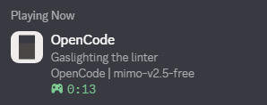
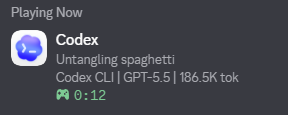
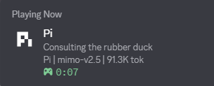

# AgentPresence

A small local Rust runtime that publishes local AI agent activity to Discord Rich Presence.

It detects which AI coding agent (Codex, Pi, OpenCode) is active in your terminals and automatically updates your Discord status. Switch between agents and your Discord status follows.





## Privacy Model

For a detailed breakdown of what the app accesses, see [TRANSPARENCY.md](TRANSPARENCY.md).

- Reads local session files from `%USERPROFILE%\.codex\sessions`, `%USERPROFILE%\.pi\agent\sessions`, and `%USERPROFILE%\.local\share\opencode\`.
- Reads OpenCode workspace config from `%APPDATA%\ai.opencode.desktop\`.
- Optionally scans local process command lines to detect running agents.
- Sends activity only to the local Discord desktop IPC pipe.
- Does not make HTTP requests at runtime.
- Does not install startup entries.
- Does not require administrator permissions.
- Uses the shared Discord application ID in `config.example.json` by default. You can replace it with your own Discord application ID if you want your own app name/assets.

## Quick Start

Prerequisites:

- Discord desktop app running.
- Rust installed, if building from source.

### Option 1: Download Prebuilt Binary

Download the latest release from [GitHub Releases](https://github.com/Zenolitee/AgentPresence/releases) and run it directly:

```powershell
.\multi-agent-presence.exe
```

### Option 2: Build From Source

```powershell
git clone https://github.com/Zenolitee/AgentPresence.git
cd AgentPresence
cargo run --release
```

Check what the app can currently see:

```powershell
cargo run --release -- status
```

Run once and exit:

```powershell
cargo run --release -- once
```

If using a prebuilt executable:

```powershell
.\target\release\multi-agent-presence.exe
```

## Config Location

The runtime looks for config here:

```text
%USERPROFILE%\.codex-discord-presence\config.json
```

On Windows, that is usually:

```text
C:\Users\<you>\.codex-discord-presence\config.json
```

Open it with:

```powershell
notepad "$env:USERPROFILE\.codex-discord-presence\config.json"
```

If the file does not exist yet, create it from the example:

```powershell
New-Item -ItemType Directory -Force "$env:USERPROFILE\.codex-discord-presence"
Copy-Item .\config.example.json "$env:USERPROFILE\.codex-discord-presence\config.json"
```

## Display Options

Edit `%USERPROFILE%\.codex-discord-presence\config.json`:

```json
{
  "client_id": "1522704011491545159",
  "opencode_client_id": "1522861438778212463",
  "pi_client_id": "1522861633909821581",
  "large_image": "codex-logo",
  "large_text": "Codex",
  "claude_large_image": "claude-logo",
  "claude_large_text": "Claude Code",
  "opencode_large_image": "opencode-logo",
  "opencode_large_text": "OpenCode",
  "pi_large_image": "pi-logo",
  "pi_large_text": "Pi",
  "hide_project": false,
  "hide_model": false,
  "show_branch": true,
  "flavor_text": true,
  "show_activity": true,
  "show_surface": true,
  "show_plan": false,
  "show_tokens": true,
  "show_cost": true,
  "show_context": false,
  "show_limits": false,
  "priority_presence": true,
  "detect_processes": true,
  "detect_codex": true,
  "detect_pi": true,
  "detect_opencode": true,
  "poll_seconds": 2,
  "stale_seconds": 180,
  "codex_home": null,
  "pi_home": null
}
```

### Option Reference

- `client_id`: Discord application ID used for the Rich Presence app name and assets. The default uses the shared AgentPresence app.
- `opencode_client_id`: Discord application ID used when OpenCode is detected.
- `pi_client_id`: Discord application ID used when Pi is detected.
- `large_image`: Discord Rich Presence asset key for Codex. The shared app expects `codex-logo`.
- `large_text`: hover text for the Codex image.
- `claude_large_image` / `claude_large_text`: Discord asset key and hover text used when Claude Code is detected.
- `opencode_large_image` / `opencode_large_text`: Discord asset key and hover text used when OpenCode is detected.
- `pi_large_image` / `pi_large_text`: Discord asset key and hover text used when Pi is detected.
- `hide_project`: when `true`, hides the current workspace folder name.
- `hide_model`: when `true`, hides the model name, such as `GPT-5.5`.
- `show_branch`: shows the current git branch when the workspace is inside a git repo.
- `flavor_text`: rotates the main Discord details line when no specific activity is available.
- `show_activity`: shows the latest coarse activity, such as `Running command cargo test`, `Applying patch`, or `Searching the web`.
- `show_surface`: shows where Codex is running from, such as `Codex CLI`, `Codex VS Code`, or `Codex App`.
- `show_plan`: shows the detected local plan label, such as `Plus ($20/month)`.
- `show_tokens`: shows total token usage for the current session, such as `6.4M tok`.
- `show_cost`: attempts to show estimated cost only when a local pricing entry exists. If no reliable pricing exists, cost is omitted.
- `show_context`: shows latest context-window usage, such as `Ctx 58% used`.
- `show_limits`: shows quota-window usage, such as `5h 81% | 7d 42%`.
- `priority_presence`: republishes frequently so Codex stays above other Discord activities more reliably.
- `detect_processes`: enables fallback process command-line detection for Claude Code, OpenCode, and Pi.
- `detect_codex`: enables Codex session detection. Set to `false` when testing other agents while Codex is still running.
- `detect_pi`: enables Pi session detection.
- `detect_opencode`: enables OpenCode session detection.
- `poll_seconds`: refresh interval in seconds. With `priority_presence` enabled, use `2`.
- `stale_seconds`: how long after the latest Codex update a session still counts as active.
- `codex_home`: optional override for the Codex home directory. Leave `null` to use `%USERPROFILE%\.codex`.
- `pi_home`: optional override for the Pi home directory. Leave `null` to use `%USERPROFILE%\.pi`.

## What Shows Where

Discord has two main text rows:

- Details line: current activity or flavor text.
- State line: compact metadata, selected from enabled fields.

Examples:

```text
Running command cargo test
MyRepo | Codex CLI | main | GPT-5.5 | 6.4M tok
```

```text
Arguing with TypeScript
AgentPresence | Codex CLI | GPT-5.5
```

The state line has a Discord length limit, so the app adds enabled fields in priority order and skips anything that would make the line too long.

## Flavor Text

When `flavor_text` is enabled, the details line can rotate through phrases like:

```text
Arguing with TypeScript
Bribing the compiler
Negotiating with bugs
Summoning stack traces
Feeding tokens to Codex
Debugging by vibes
Turning errors into lore
```

## Setup

The default config uses the shared AgentPresence Discord application ID, so most users only need to copy `config.example.json` into their config folder.

To use your own Discord application instead:

1. Create a Discord application at <https://discord.com/developers/applications>.
2. Copy the application Client ID.
3. Upload the files in `assets/` as Rich Presence art assets. The default config expects `codex-logo`, `claude-logo`, `opencode-logo`, and `pi-logo`.
4. Replace `client_id`, `opencode_client_id`, and `pi_client_id` in `%USERPROFILE%\.codex-discord-presence\config.json` if you want to use your own apps instead of the defaults.

## Multi-Agent Images

AgentPresence uses one Discord application and switches `assets.large_image` based on the detected agent. The image values must be uploaded Rich Presence asset keys in that Discord application; Discord cannot read local image files directly.

Detection is based on session file modification times. When you type in a terminal, that agent's session file gets updated, and the app switches Discord status to match. Process detection runs as a fallback to confirm agents are still running.

You can temporarily override the client ID through:

```powershell
$env:CODEX_DISCORD_CLIENT_ID = "your_client_id"
```

## Run

```powershell
cargo run --release
```

Useful commands:

```powershell
cargo run --release -- status
cargo run --release -- once
```

## Notes

Discord must be running. The image in `assets/` is only for uploading to your Discord application; Discord Rich Presence references uploaded asset keys, not arbitrary local files.

Cost display is intentionally conservative. Codex session files include token usage, but may not include an authoritative pricing table, so cost is omitted unless a reliable pricing entry is available.

## How Detection Works

AgentPresence detects which AI agent is active by reading session files and checking running processes. Detection is automatic — no manual toggling needed when switching between agents.

### Session File Locations

Each agent stores session data in a specific location under your user profile:

| Agent | Session/Config Path | What It Reads |
|-------|-------------------|---------------|
| Codex | `%USERPROFILE%\.codex\sessions\` | JSONL session files (project, model, tokens, cost, activity) |
| Pi | `%USERPROFILE%\.pi\agent\sessions\` | JSONL session files (project, model, tokens, cost) |
| OpenCode | `%USERPROFILE%\.local\share\opencode\` | SQLite database (`opencode.db`) for model info |
| OpenCode | `%APPDATA%\ai.opencode.desktop\` | Workspace and global config files (project, branch) |

### Process Detection

When `detect_processes` is enabled (default), the app also checks running processes as a fallback. It runs a PowerShell command every poll cycle to list all processes and matches against known agent process names:

- **Codex**: `codex.exe`, `codex.cmd`, `@openai/codex`, `openai/codex`
- **OpenCode**: `opencode`, `sst-dev.opencode`
- **Pi**: `pi.ai`, `inflection`, `pi desktop`, `pi-node`, `\pi.exe`
- **Claude Code**: `claude`, `@anthropic-ai/claude-code`

### Agent Switching

The app determines the active agent by comparing session file modification times. When you type in a terminal, that agent's session file gets updated, and the app switches Discord status to match.

### Known Limitations

- **Windows Terminal tabs**: All tabs share the same foreground window PID, so the app cannot distinguish which tab is focused by window handle alone. It relies on session file modification times instead. This means there may be a brief delay when switching tabs until the agent writes to its session file.
- **Latency**: Each poll cycle runs a PowerShell process to check running agents, adding ~1–2 seconds of overhead. With `priority_presence` enabled, polling happens every 2 seconds.
- **Pi staleness**: Pi sessions are marked inactive after `stale_seconds` (default 180) of no file writes. If Pi is idle for 3+ minutes, it will not show as active until you type something.
- **Windows only**: Uses Win32 APIs (`GetForegroundWindow`, `GetWindowTextW`) and PowerShell for process detection. Does not work on macOS or Linux.
- **Session file format**: Detection depends on each agent writing session data to the expected directory structure. If an agent is installed differently (custom home directory, different session format), detection may not work. Use `codex_home` and `pi_home` config overrides if needed.
